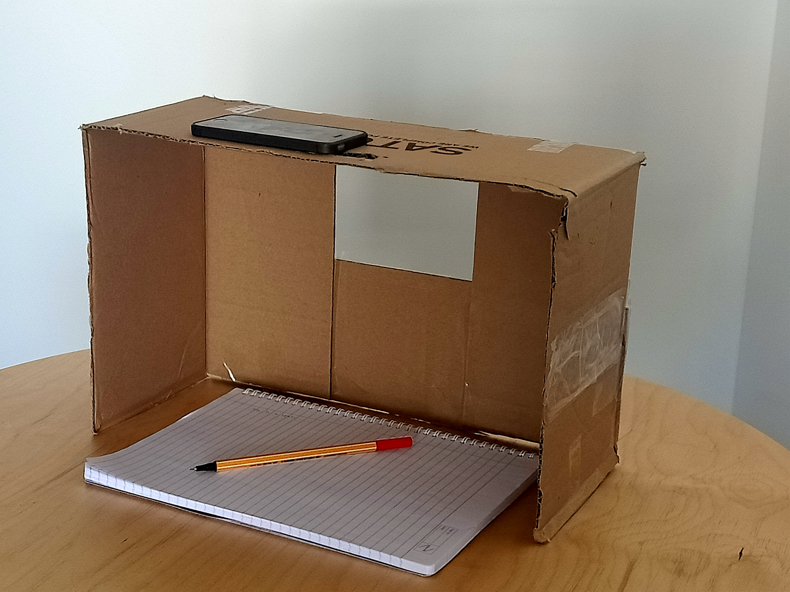

# eyeStand

A cardboard webcam mount to record and stream video lectures. Simply place your smartphone on the eyeStand and easily teach online without buying any expensive touchscreen devices.

There are two versions of the eyeStand, depending on the manufacturing abilities of the user.

**eyePhone_Cardboard.pdf** is a pdf file detailing the instructions of the cardboard version (written in tex, source also included).

**eyePhone.scad** is an OpenSCAD design of a 3d printable version. The **eyeStand.stl** file is simply the exported file from OpenSCAD, ready to be given to a 3D printer.

The design has been created after considering the best height and dimensions to include most smartphones and standard A4 sheets. Feel free to customize, if you don't feel it fits for you.

--------------------------------------------------------

This project was created as part of LauzHack 2020 (at EPFL, Lausanne).

Here is the [Devpost link](https://devpost.com/software/eyestand) of the project.

 
